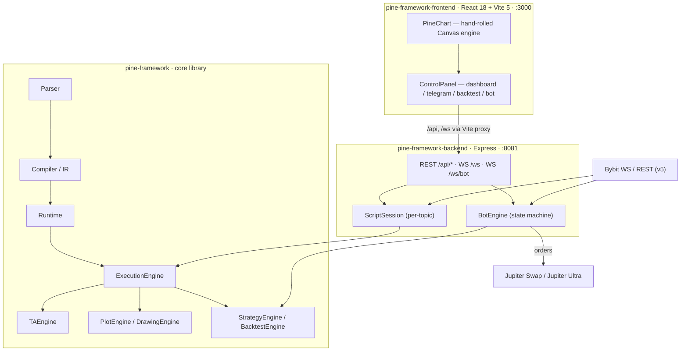

# PineFramework

> A Pine Script v6-compatible execution and rendering engine — with backtesting and **live trading on Solana DEXes**, fed by Bybit market data.

[](.github/workflows/ci.yml)
[]()
[]()
[]()
[]()
[-A3A3A3)](#license)

---

## What is it?

PineFramework is a **Pine Script v6-compatible execution and rendering engine** written in TypeScript and packaged as a pnpm monorepo. It runs Pine Script v6 programs through a full language pipeline — **parser → compiler (IR) → runtime** — over live or historical market data, renders the results on a **hand-rolled HTML Canvas chart engine**, and backs it with a **commission-aware backtesting** stack and a **feature-gated live trading bot** that executes strategies on **Solana DEXes (Jupiter Swap / Jupiter Ultra)** from **Bybit WebSocket** feeds. A React dashboard and an Express API wrap the whole engine.

- 🧩 **Real Pine Script v6 pipeline** — parser, IR compiler, and runtime with NA semantics, plots/drawings/markers, and alerts; 14 built-in `.pine` indicators served via `GET /api/builtInScripts`.
- 🖌️ **Zero-dependency charting** — `PineChart`, a hand-rolled Canvas engine (31 KB core) with layout, viewport, and interaction managers. No stock-chart library.
- 🧮 **IEEE-754-safe arithmetic** — `safeAdd` / `safeSub` / `safeMul` / `safeDiv`, NaN→NA propagation, and Kahan-compensated summation — documented in [`docs/ieee754-compatibility.md`](docs/ieee754-compatibility.md).
- 🧪 **Commission-aware backtesting** — pluggable commission models, including **Jupiter Ultra fee tiers**, via UI, REST, or the `pine-backtest` CLI.
- 🤖 **Live trading bot** — deterministic state machine, risk manager, AES-256-GCM-encrypted Solana wallet, and live execution through Jupiter Swap / Jupiter Ultra — documented in [`docs/trading-bot.md`](docs/trading-bot.md).
- ✅ **Engineered for trust** — full test pyramid: unit, adversarial fuzz (`parser-no-silent`, `compiler-no-silent`, `fuzz-pipeline`), per-indicator integration, backend route tests, and Playwright e2e.

---

## Table of Contents

- [What is it?](#what-is-it)
- [Features](#features)
  - [Pine Script v6 Engine](#pine-script-v6-engine)
  - [Hand-Rolled Canvas Rendering](#hand-rolled-canvas-rendering)
  - [Backtest Engine](#backtest-engine)
  - [Trading Bot](#trading-bot)
  - [Telegram Integration](#telegram-integration)
  - [IEEE-754 Float Safety](#ieee-754-float-safety)
  - [Plugins and Extensibility](#plugins-and-extensibility)
- [Architecture](#architecture)
  - [Package Map](#package-map)
  - [System Overview](#system-overview)
  - [Key Data Flows](#key-data-flows)
  - [HTTP and WebSocket Surface](#http-and-websocket-surface)
  - [Public Library Surface](#public-library-surface)
- [Getting Started](#getting-started)
  - [Prerequisites](#prerequisites)
  - [Install](#install)
  - [Run the Dev Servers](#run-the-dev-servers)
  - [Verify It Works](#verify-it-works)
- [Live Trading Bot](#live-trading-bot)
  - [Enabling and Disabling](#enabling-and-disabling)
  - [State Machine](#state-machine)
  - [Risk Guards](#risk-guards)
  - [Wallet and Encryption](#wallet-and-encryption)
  - [Bot API](#bot-api)
- [Backtesting](#backtesting)
- [Configuration](#configuration)
- [Repository Structure](#repository-structure)
- [Testing](#testing)
- [CI/CD](#cicd)
- [Docker](#docker)
- [Security Notes](#security-notes)
- [Documentation](#documentation)
- [License](#license)

---

## Features

### Pine Script v6 Engine

The core library (`src/language/`) implements a complete Pine Script v6-compatible pipeline: a **parser**, a **compiler** that lowers programs to an intermediate representation (**IR**), and a **runtime** (execution engine) that evaluates over bars. The runtime ships guarded float arithmetic and NA semantics so indicator math behaves like TradingView's (see [IEEE-754 Float Safety](#ieee-754-float-safety)).

Scripts emit **outputs, plots, and markers** that the rendering engine consumes. The repo ships **14 built-in `.pine` test indicators** (`test_indicators/` — macd, supertrend variants, q-trend, kalman trend levels, strategies, alerts, and more), served to the UI via `GET /api/builtInScripts`.

### Hand-Rolled Canvas Rendering

The frontend renders charts with **`PineChart`** — a hand-rolled Canvas engine at `frontend/src/chart/` (core `PineChart.ts`, ~31 KB) composed of a `LayoutManager`, `ViewportManager`, `InteractionHandler`, and a `plot-series-manager` over dedicated renderers. **No stock-chart library is used**; the only charting dependency in the project is **Recharts**, and it is reserved for statistics and backtest-result charts (equity/drawdown views). The UI kit is shadcn/ui (Radix, lucide-react, Tailwind, class-variance-authority).

### Backtest Engine

`BacktestEngine` (`src/strategy/`) runs Pine strategies over historical bars with a pluggable **commission-calculator** and a family of `commission-methods` — including **Jupiter Ultra fee tiers** via `jupiter-fee-fetcher`. Strategy metrics, equity/drawdown, alert generation, and trailing-stop management are built in. Results are pinned by `backtest-parity` and `backtest-golden-capture` tests so a refactor cannot silently change answers. See [Backtesting](#backtesting) for the three ways to run one.

### Trading Bot

The live trading bot (Phase 2 complete per [`docs/trading-bot.md`](docs/trading-bot.md)) is **feature-gated and enabled by default** — see [Enabling and Disabling](#enabling-and-disabling). It is built around a deterministic state machine, a symbol×timeframe scheduler consuming Bybit WebSocket bars, a live strategy executor (Pine Script → order signals), a `RiskManager`, an encrypted `WalletManager`, and Jupiter Swap / Jupiter Ultra adapters. Full details in the [Live Trading Bot](#live-trading-bot) section.

### Telegram Integration

`TelegramService` (telegraf) plus the transport-agnostic `TelegramBotFeature` deliver bot lifecycle events — start/stop, position open/close, errors, and daily-loss alerts — with **PNG report cards rendered via sharp**. Proxy support runs through `https-proxy-agent` (the proxy URL is **never logged**). An admin/controller/linked-chat access model with per-member subscriptions keeps control granular; configuration persists to `backend/data/telegram.json` and is managed through `/api/settings`.

### IEEE-754 Float Safety

`src/language/runtime/float-guards.ts` closes the floating-point traps that silently corrupt trading indicators:

- **Guarded arithmetic** — `safeAdd`, `safeSub`, `safeMul`, `safeDiv`
- **NA propagation** — NaN/Infinity flow to the script's NA value instead of poisoning the series
- **Global NaN sanitization** and `math.round` stability
- **Kahan-compensated summation** for long-running accumulation

The full contract, rationale, and contributor guidelines live in [`docs/ieee754-compatibility.md`](docs/ieee754-compatibility.md).

### Plugins and Extensibility

`src/extensibility/` provides a **`PluginRegistry` + `PluginManager`** pair for extending the engine without touching core code, exported from the library root. The project's change workflow is OpenSpec-managed (`openspec/`), and `knip.json` tracks every workspace entry — including all subpath exports — to keep the public surface lean and verified.

---

## Architecture

### Package Map

| Package | Type | Port | Role |
|---------|------|------|------|
| `pine-framework` (root) | TypeScript library · v0.1.0 | — | The engine: language pipeline, data engine, TA engine, rendering, strategy/backtest, trading |
| `pine-framework-backend` | Express API | `8081` (`PORT`) | REST `/api/*`, WebSockets `/ws` + `/ws/bot`, Bybit integration, bot control plane |
| `pine-framework-frontend` | React 18 + Vite 5 + Tailwind 4 + shadcn/ui | `3000` | ControlPanel (dashboard / telegram / backtest / bot), PineChart canvas, Playwright e2e |

### System Overview



### Key Data Flows

1. **OHLCV / chart rendering** — `App.tsx → useChartData.fetchOHLCV → GET /api/ohlcv → ohlcv router → OHLCVCache + DiskOHLCVCache → Bybit data source → bars → ChartComponent → PineChart` (canvas render).
2. **Script execution** — `CodeEditor → POST /api/execute → executeRouter → ExecutionEngine (parse → compile → runtime over bars) → outputs/plots/markers → ChartComponent`. Live updates ride `/ws`: `gateway.ts ScriptSession → Bybit WS feed → engine → broadcast 'execute' results → useChartData.handleExecutionResult → mergeDiffIntoResult` for forming candles.
3. **Backtest** — `BacktestPanel → POST /api/backtest → BacktestEngine (commission models incl. Jupiter Ultra) → results → Recharts (BacktestResults) → StatisticsTab`. CLI path: `pine-backtest` bin → `backend/src/cli/backtest-cli.ts`.
4. **Live bot** — `TradingBotPanel / useBotWebSocket → POST /api/bot/configure|start|stop|emergency-stop → BotEngine → live-scheduler (symbol×timeframe mutex) → Bybit WS bar feed → live-strategy-executor → signals → RiskManager guards → WalletManager (Solana BIP44) → dex-registry → jupiter-swap / jupiter-ultra → order submission`. Events broadcast on `/ws/bot`.
5. **Trade history / statistics** — `BotEngine → TradeHistoryStore (JSONL: backend/data/trade-history/{botId}/trades.jsonl) → StatsService → GET /api/bot/history (composite-cursor pagination) + /api/bot/stats → TradeHistoryTab + StatisticsTab`. The same StatsService feeds Telegram `/report` (PNG card via sharp).
6. **Telegram** — `BotEngine events → TelegramBotFeature (lazy getEngine seam, transport-agnostic) → TelegramService (telegraf, https-proxy-agent) → notifications + PNG report cards`. Config via `/api/settings → TelegramConfigStore (backend/data/telegram.json)`.

### HTTP and WebSocket Surface

All REST routes are mounted under `/api` on the backend:

| Area | Routes |
|------|--------|
| Market data | `/api/ohlcv`, `/api/bars`, `/api/symbols`, `/api/status` |
| Scripts & execution | `/api/execute`, `/api/indicators`, `/api/scripts`, `/api/builtInScripts`, `/api/export`, `/api/logs` |
| Backtest | `/api/backtest` |
| Bot | `/api/bot/*` (see [Bot API](#bot-api)) |
| Telegram | `/api/settings`, `/api/telegram/proxy-test`, `/api/telegram/test` |
| Trade history | `/api/trade-history/bot/history`, `/api/trade-history/bot/stats` |

WebSockets:

- **`/ws`** — main gateway: a `ScriptSession` per topic, Bybit live feed, price-reasonability rejection (`rejectIfUnreasonable`), and the `frontend:log` channel.
- **`/ws/bot`** — bot gateway channels: `bot:snapshot`, `bot:state`, `bot:log`, `bot:position`, `bot:metrics`, `bot:feedStatus`, `bot:candleError`.

### Public Library Surface

```ts
// root exports — src/index.ts (VERSION = '0.1.0')
import {
  parse, compile, parseAndCompile, executeScript,
  createDataEngine, createRequestSystem, barsToContext,
  ExecutionEngine, DataEngine, RequestSystem, TAEngine,
  InputSystem, ConfigManager, PlotEngine, DrawingEngine,
  StrategyEngine, BacktestEngine, AlertSystem,
  PluginRegistry, PluginManager,
} from 'pine-framework';
```

Subpath exports keep heavier domains importable on demand:

```
pine-framework/trading/wallet
pine-framework/trading/config-store
pine-framework/trading/trade-history-store
pine-framework/trading/telegram-bot
pine-framework/strategy/jupiter-fee-fetcher
pine-framework/utils/time
pine-framework/utils/logger/types
pine-framework/utils/script-name
pine-framework/util/candle-string-format
```

> **Frontend note:** the Vite bundle resolves the library to `src/frontend-safe.ts` — a browser-safe entry that excludes Node-builtin-dependent modules (no trading engine in the web bundle) and adds the token registry (`TRADABLE_PAIRS`, `TOKEN_REGISTRY`, `getTokenInfo`).

---

## Getting Started

### Prerequisites

- **Node.js ≥ 20**
- **pnpm** (CI pins **pnpm 9.15**)
- **just** (optional — the Justfile recipes are the canonical commands; direct `pnpm` equivalents are listed too)

### Install

```bash
pnpm install
```

### Run the Dev Servers

The supported, working path is **local development**: Vite serves the frontend on `:3000` and proxies `/api` and `/ws` to the backend on `:8081`.

```bash
# Backend (:8081) + frontend (:3000), concurrently
just dev        # alias: just d
# or directly:
pnpm dev
```

### Verify It Works

1. Open **http://localhost:3000** — the ControlPanel loads with four panels: **dashboard · telegram · backtest · bot**.
2. Check the API from your terminal:

   ```bash
   curl http://localhost:8081/api/status
   ```

3. Pick a built-in indicator (list: `GET /api/builtInScripts`), load a symbol, and run it — the chart renders on the custom Canvas engine, and live updates stream over `/ws`.

---

## Live Trading Bot

The bot executes your Pine strategies against real Solana DEX liquidity: it subscribes to Bybit WebSocket bars, evaluates the loaded Pine script, passes signals through the risk manager, and submits orders via **Jupiter Swap / Jupiter Ultra**. Bot state and every trade are recorded (JSONL at `backend/data/trade-history/{botId}/trades.jsonl`), and lifecycle events can be pushed to Telegram as text plus PNG report cards. Per [`docs/trading-bot.md`](docs/trading-bot.md), the bot is **Phase 2 complete**.

### Enabling and Disabling

⚠️ **The bot is enabled by default.** The backend reads `ENABLE_TRADING_BOT` as `process.env.ENABLE_TRADING_BOT !== 'false'` — it starts unless you explicitly disable it.

```bash
# Disable the bot (recommended for indicator-only / backtest-only work)
ENABLE_TRADING_BOT=false
```

Also: when operating the bot, run the backend **without file-watch** — a watch-restart kills the live Bybit WebSocket connection:

```bash
just dev-bot   # backend without watch
```

### State Machine

`BotEngine` runs a deterministic state machine:

```
Idle → Starting → Running → Stopping → Stopped
                  ↘
                  Error
```

A scheduler manages the symbol×timeframe matrix with a mutex, and a live strategy executor turns Pine signals into orders. Every transition is broadcast on `/ws/bot` (`bot:state`, plus `bot:snapshot`, `bot:log`, `bot:position`, `bot:metrics`, `bot:feedStatus`, `bot:candleError`).

### Risk Guards

`RiskManager` validates every signal before it reaches the exchange:

- **Daily stop-loss** — halt trading for the day once the loss limit is hit
- **Wallet-balance guard** — never submit an order the wallet cannot cover
- **Rolling loss guard** — stops sustained losing streaks

⚠️ **Known gap:** `emergencyClosePositions` is still a stub (documented in [`docs/trading-bot.md`](docs/trading-bot.md)). Treat emergency close as **not yet available** when sizing positions.

### Wallet and Encryption

`WalletManager` + `EncryptedFileStorage` manage the trading wallet:

- **Seed phrase import** and **BIP44** key derivation
- Keychain encrypted with **AES-256-GCM**
- **SPL token** support

Wallet operations are exposed through `/api/bot/wallet/*` (import, preview, unlock, lock, password management). The keychain is protected by `WALLET_PASSPHRASE` — see [Security Notes](#security-notes) before using real funds.

### Bot API

All endpoints are mounted under `/api/bot/*` and feature-gated by `ENABLE_TRADING_BOT`:

| Method | Routes |
|--------|--------|
| `POST` | `/bot/start`, `/bot/stop`, `/bot/emergency-stop`, `/bot/reset`, `/bot/configure`, `/bot/backtest`, `/bot/chaos-mode`, `/bot/wallet/import`, `/bot/wallet/preview`, `/bot/wallet/set-password`, `/bot/wallet/unlock`, `/bot/wallet/lock`, `/bot/wallet/forgot-password`, `/bot/wallet/change-password` |
| `GET` | `/bot/status`, `/bot/config`, `/bot/wallet`, `/bot/wallet/balance`, `/bot/wallet/status` |
| `PATCH` | `/bot/config/chaos-mode` |
| `DELETE` | `/bot/config`, `/bot/wallet` |

A quick-start `curl` flow, WS channel reference, env vars, and the architecture decisions are in [`docs/trading-bot.md`](docs/trading-bot.md).

---

## Backtesting

`BacktestEngine` runs Pine strategies over historical bars with **pluggable commission models** — including **Jupiter Ultra fee tiers** via `jupiter-fee-fetcher` — plus strategy metrics, equity/drawdown, and trailing-stop management.

**Commission methods.** Exactly two are supported: **Jupiter Swap** (`jupiter_manual`) and **Jupiter Ultra** (`jupiter_ultra`). The CLI requires `--commission-method` (the legacy `--commission` / `--commission-type` flags are removed) and the REST API requires `commissionMethod` in explicit overrides. Live Jupiter fees are fetched and cached for 10 minutes; an explicit `dexFeeBps` bypasses the fetch, and a fetch failure fails the run loudly rather than fall back to a wrong fee. Both CLI and API report **what actually ran** — an effective-config summary (resolved date range, commission method, sizing and capital) plus typed warnings (suppressed orders, fee decisions, cached or failed live fees, auto-selected method).

| Entry point | How |
|-------------|-----|
| **CLI** | `pnpm backtest` → `pine-backtest` bin → `backend/src/cli/backtest-cli.ts` (multi-symbol runner, result aggregator, output formatter) |
| **REST** | `POST /api/backtest` |
| **UI** | BacktestPanel → results rendered with Recharts (equity/drawdown, statistics tab) |

Results are pinned by `backtest-parity` and `backtest-golden-capture` tests, so changing the engine never silently changes historical answers.

---

## Configuration

| Variable | Default | Description |
|----------|---------|-------------|
| `PORT` | `8081` | Backend HTTP port. The server binds **`127.0.0.1` only** (see [Security Notes](#security-notes)). |
| `ENABLE_TRADING_BOT` | **enabled** (off only when set to `false`) | Feature gate for the live trading bot. |
| `WALLET_PASSPHRASE` | `pine-default-passphrase` | Passphrase protecting the encrypted wallet keychain — ⚠️ **must be set to a strong value in production**. |
| `BYBIT_WS_URL` | `wss://stream.bybit.com/v5/public/linear` | Bybit WebSocket feed endpoint. |
| `NODE_ENV` | — | Runtime mode (e.g. `production` in the container stack). |

> No `.env.example` is shipped yet; `.gitignore` excludes `.env` / `.env.local`. Copy the variables you need into a local `.env`.

---

## Repository Structure

```text
pine-framework/                  # repo root — pnpm workspace (library = root package)
├── src/                         # pine-framework — core engine library
│   ├── language/                #   parser · compiler/IR · runtime (execution-engine, float-guards, NA)
│   ├── data/                    #   bar, data-engine, request-system
│   ├── analysis/                #   TAEngine, ta-registry, oscillators, math functions
│   ├── config/                  #   config-manager, input-system, color-system
│   ├── rendering/               #   plot-engine, drawing-engine, primitives
│   ├── strategy/                #   strategy-engine, backtest-engine, commission methods, metrics
│   ├── trading/                 #   bot-engine, state-machine, schedulers, wallet/, dex/, risk/, telegram-bot
│   ├── extensibility/           #   plugin-manager / plugin-registry
│   ├── performance/             #   cache, object-pool, profiler
│   ├── pnl/                     #   core, decimal, fees, fee-tiers, aggregate
│   ├── util/ · utils/           #   shared helpers
│   ├── frontend-safe.ts         #   browser-safe entry used by the Vite bundle (no trading engine)
│   └── index.ts                 #   public API + VERSION
├── backend/                     # pine-framework-backend — Express API (:8081)
│   ├── src/
│   │   ├── index.ts             #   app bootstrap, 127.0.0.1-only bind, feature gates
│   │   ├── routes/              #   /api/ohlcv · /execute · /backtest · /bot · /settings · …
│   │   ├── ws/                  #   gateway.ts (main) · bot-gateway.ts
│   │   ├── bybit/               #   bybit-data-source, fetch-bars, rate-limiter
│   │   ├── store/               #   JSON stores, script manager, telegram config store
│   │   ├── session/             #   ScriptSession, FormingCandleManager
│   │   └── cli/                 #   pine-backtest CLI
│   └── tests/                   #   ~44 route/integration tests
├── frontend/                    # pine-framework-frontend — React 18 + Vite 5 (:3000)
│   ├── src/
│   │   ├── App.tsx              #   ControlPanel: dashboard · telegram · backtest · bot
│   │   ├── chart/               #   PineChart — hand-rolled Canvas engine
│   │   └── hooks/               #   useChartData, useBacktest, useBotWebSocket, …
│   ├── e2e/                     #   8 Playwright specs
│   └── vite.config.ts           #   port 3000 · /api + /ws proxies → :8081
├── test_indicators/             # 14 built-in .pine scripts → GET /api/builtInScripts
├── docs/
│   ├── trading-bot.md
│   └── ieee754-compatibility.md
├── tests/                       # unit · evil (fuzz) · integration · realtime · strategy · util
├── openspec/                    # OpenSpec-managed change workflow
├── .github/workflows/ci.yml     # just test + just check gates
├── Justfile                     # canonical recipes (dev / test / check / dev-bot / podman-*)
├── compose.yml                  # container stack (see Docker)
└── package.json                 # pnpm workspace root (private)
```

---

## Testing

The project runs a full test pyramid:

| Layer | Location | Coverage |
|-------|----------|----------|
| **Unit** | `tests/unit`, `tests/language`, `tests/data`, `tests/analysis`, `tests/rendering`, `tests/strategy`, `tests/util` | Engine internals, NA semantics, config, performance |
| **Adversarial / fuzz** | `tests/evil` | `fuzz-pipeline`, `parser-no-silent`, `compiler-no-silent` — no silent failures on hostile input |
| **Integration** | `tests/integration` | Per-indicator: macd, q-trend, supertrend-kmeans, kalman, `realtime-*`; plus `trading/` |
| **Backend** | `backend/tests` (~44 files) | Bot routes, trade history routes, bybit data source, telegram, stats-service, CLI backtest, backtest parity / golden-capture, disk OHLCV cache |
| **Frontend** | frontend vitest (jsdom) | Components, hooks, logger (`src/test-setup.ts`) |
| **E2E** | `frontend/e2e` — 8 Playwright specs | `backtest-results-chart`, `trade-dashboard`, `sidebar-overlay`, `chart-toolbar-selects`, `dashboard-toolbar`, `scroll-back`, `chunk-boundary`, `chunk-border-visual-regression` |

Run everything with the canonical recipes (Playwright boots both servers itself — `frontend/playwright.config.ts` uses baseURL `http://localhost:3000`, chromium, 60s timeout, 1 retry):

```bash
just test        # alias: just t  → build:lib → vitest → frontend e2e
just check       # alias: just c  → build:lib → typecheck:all → lint → knip → build
```

Direct equivalents:

```bash
pnpm test                                  # vitest (unit + integration + backend + frontend)
pnpm typecheck                             # all workspaces
pnpm build                                 # all workspaces
pnpm --filter pine-framework run build:lib # library only
```

---

## CI/CD

[`.github/workflows/ci.yml`](.github/workflows/ci.yml) enforces two hard gates on **push to `main` and every PR**:

1. **`just test`** — build the library, run the vitest suite, then Playwright e2e
2. **`just check`** — build the library, typecheck all workspaces, lint, knip (dead-code / unused-exports), and build

Environment: **pnpm 9.15**, **Node 20**, Playwright **chromium with deps** (`--with-deps`), `setup-just` 1.36.

---

## Docker

A container stack exists, but treat it as **experimental scaffolding** — local development is the supported path.

- `Containerfile` (root) — builds the library only
- `backend/Containerfile` — multi-stage `node:20-slim` + tini, runs `node backend/dist/index.js`
- `frontend/Containerfile` — node build → `nginx:alpine` serving the static SPA (EXPOSE 80)
- `compose.yml` — backend published `3000:3000` with `NODE_ENV=production`, frontend `80:80`, `restart: unless-stopped`
- Justfile `podman-*` recipes (build / up / down / logs / deploy)

⚠️ **Wiring caveat:** the containerized frontend's nginx config serves static files only — **no `/api` proxy** — and compose publishes the backend on port `3000` while the backend actually listens on `8081`. As currently wired, the containerized SPA cannot reach the API.

**Recommendation:** run the app with `just dev` (Vite on `:3000` proxying `/api` and `/ws` to `:8081`) until the container proxy wiring is fixed.

---

## Security Notes

> Real-world project, honest caveats. Read these before running the bot with real funds.

- 🔒 **Localhost-only bind** — the backend binds `127.0.0.1` only (`server.listen(PORT, '127.0.0.1')`), so the unauthenticated control plane is not reachable from other network interfaces.
- 🚫 **No authentication on the control plane** — the bot REST API (`/api/bot/*`) has **no auth**. The localhost bind is the primary mitigation; an optional IP rate limiter (`backend/src/utils/ip-rate-limiter.ts`) is the only extra defense. Do not expose this API beyond localhost.
- ⚠️ **Weak default passphrase** — `WALLET_PASSPHRASE` defaults to `pine-default-passphrase`. **Set a strong value in production** — it protects the AES-256-GCM-encrypted wallet keychain.
- 🔑 **Secrets hygiene** — no `.env.example` is shipped yet; `.gitignore` excludes `.env` / `.env.local`. Keep secrets out of git. Telegram proxy URLs are never logged.
- 🗄️ **Runtime state files** — `feed-state.json`, `strategy-state.json`, `logs/`, and `user_profile.json` at the repo root are gitignored runtime artifacts persisted by the live bot.

---

## Documentation

| Document | Contents |
|----------|----------|
| [`docs/trading-bot.md`](docs/trading-bot.md) | Bot architecture diagram, feature table, env vars, `/api/bot` API reference, WS channels, quick-start `curl` flow, state machine, architecture decisions, project structure, testing |
| [`docs/ieee754-compatibility.md`](docs/ieee754-compatibility.md) | Guarded arithmetic (`safeAdd`/`safeSub`/`safeMul`/`safeDiv`), NaN/Infinity→NA propagation, `math.round` stability, Kahan-compensated summation, contributor guidelines |

The project is OpenSpec-managed — see `openspec/` for the change workflow and spec history.

---

## License

**MIT (declared in `package.json`)** — the actual **`LICENSE` file is pending**. This is a known gap; the license declaration should not be treated as legally binding until the file ships. If you need licensing certainty before using or redistributing the project, ask the maintainers.
